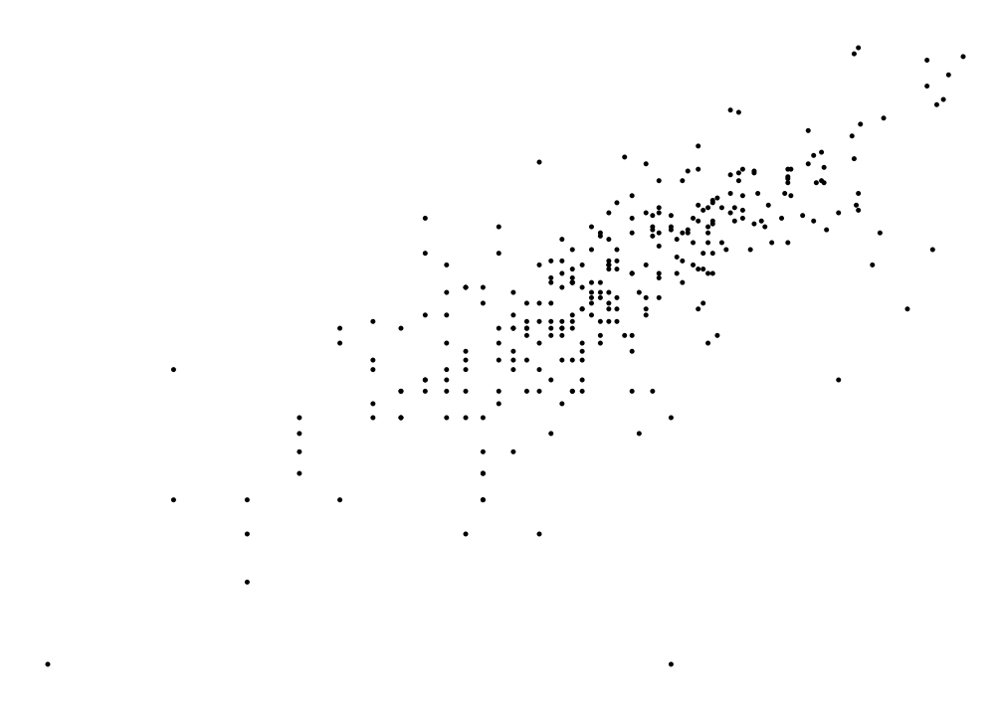
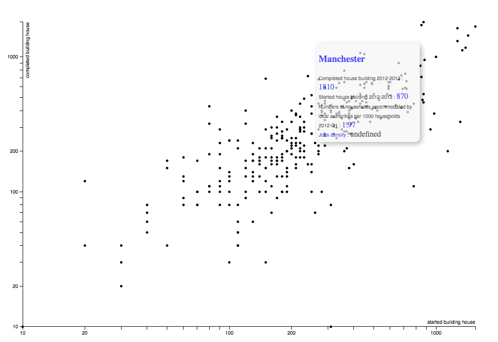
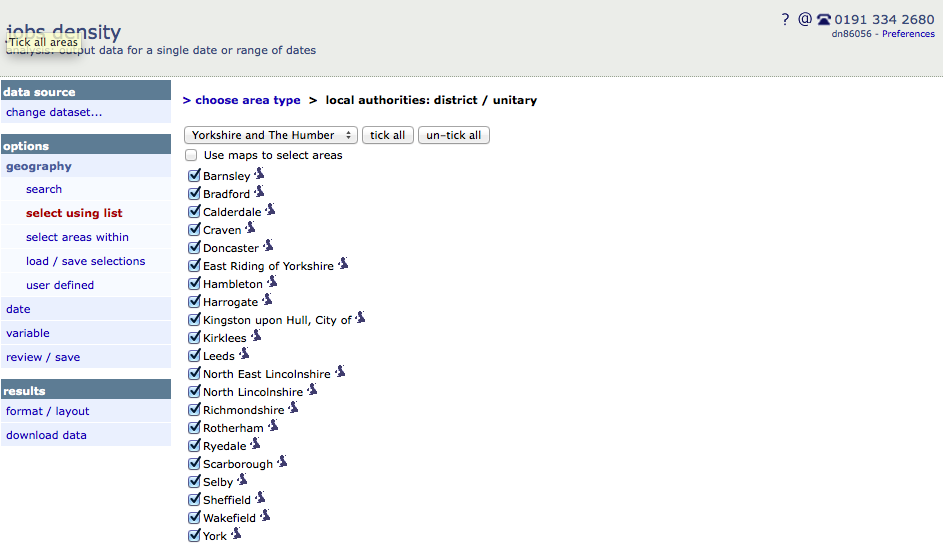
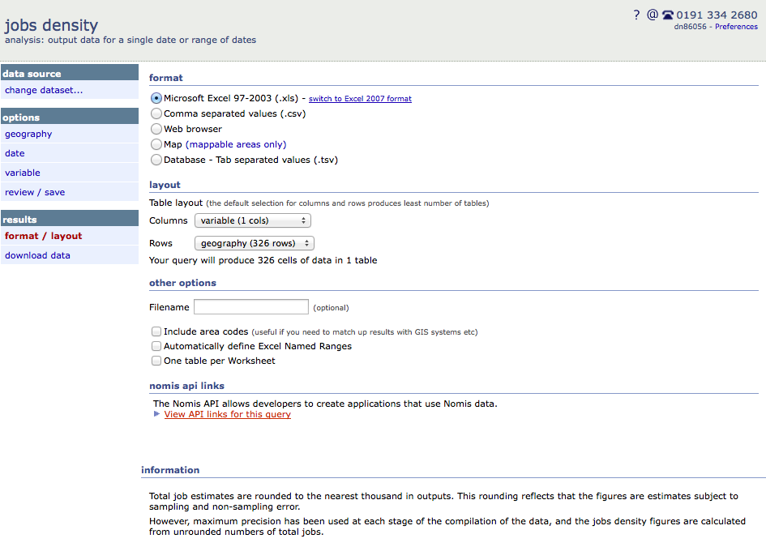
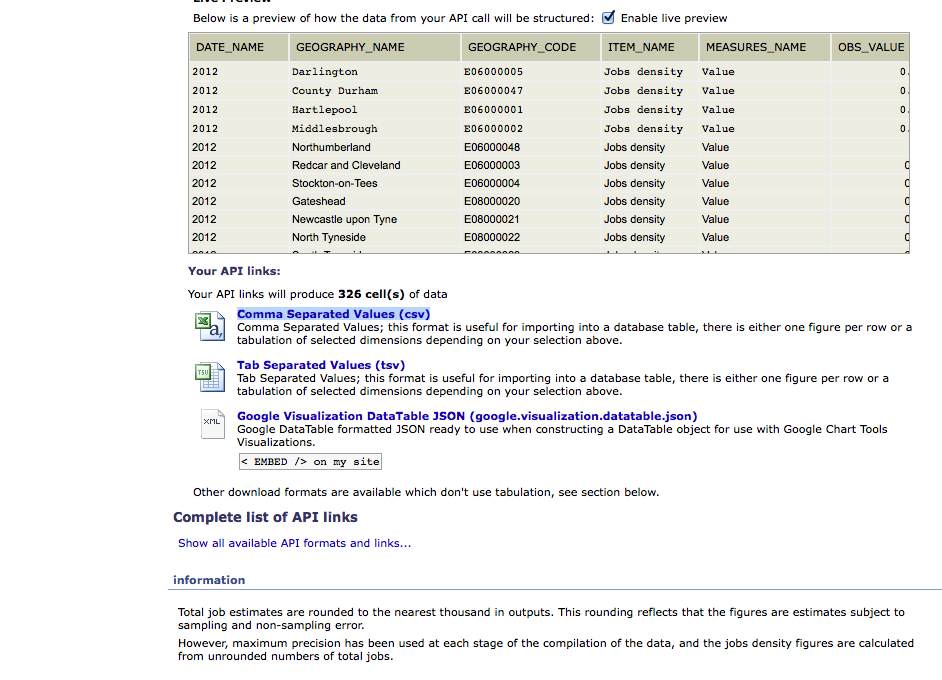
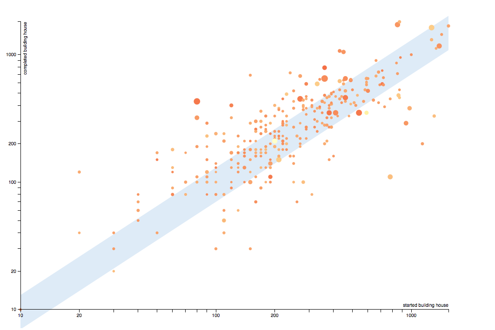
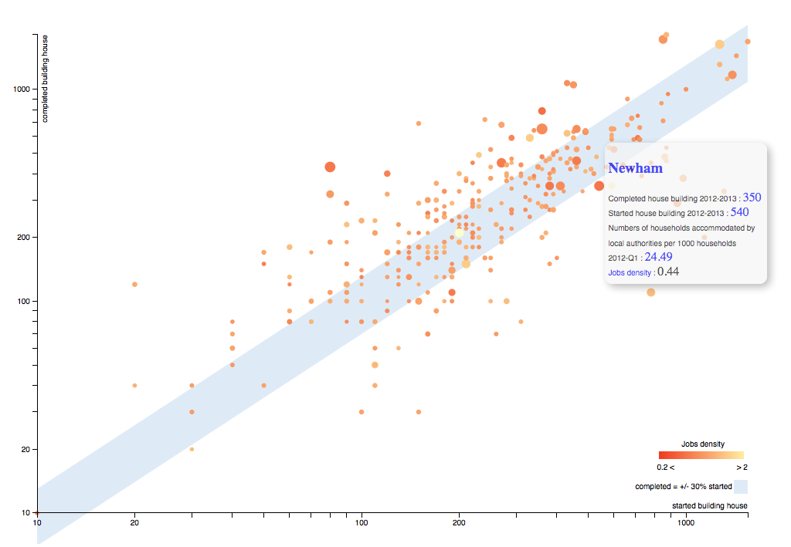

# How to use d3.js to visualize Open Data Communities and NOMIS data

I've started an internship at [Swirrl](http://www.swirrl.com) a few weeks ago, and as the Swirrl motto "The Linked Data Company" let presume I had to dig into linked data.
I had some knowledge in web developpement but I was almost a newbie, you just need to know a little bit of HTML / CSS / Javascript. This tutorial aims to learn you to :

* Query linked data using SPARQL
* Query an API
* Visualize data on a scatter plot using [d3.js](http://d3js.org)

[You can access the code on GitHub](https://github.com/NTerpo/DCLG_data_visualization) and [here is the demo of what are we going to do.](http://jsfiddle.net/nicolasterpolilli/7ed26/5/embedded/result/)

## Step one, find linked data

To start we are going to get some data ! This is probably the most difficult part of the tutorial. Indeed nobody is naturally used to [semantic web standard's RDF](http://en.wikipedia.org/wiki/Resource_Description_Framework) ! You probably
know how to use an Excel spreadsheet, a CSV file or a SQL database, but RDF is, let say different... To understand why data are "linked", try to imagine what the internet looked like before the "link" was invented :
a "poor" list of ressources. Links between ressources have given the internet a lot of opportunities ! The idea with linked data is exactly the same, you have a huge amount of data with links between them...
Still difficult to imagine ? Don't worry we will try it on an example but you do have to imagine how powerful what you are doing can be !

### What are we doing and where those "linked data" are ?

There are more and more linked data available but we will focus on Open Data Communities which is the UK Department for Communities and Local Government's official Linked Open Data site.
Data are organized by theme and we are first going to work on [House building data](http://opendatacommunities.org/themes/house-building).

The scatter plot we are going to make will compare the number of houses started and the number of houses completed, in one year, for each local authority in England.
The X axis will be house started and the Y axis will be house completed. Later on the tutorial we will add labour market data and homelessness data so the scatter plot 
can help you understand the housing policy of each local authority.

### SPARQL query I

So let's get those data !! The main query language for querying RDF data is SPARQL. There are [some pretty good tutorials about SPARQL](https://jena.apache.org/tutorials/sparql.html) and, here I just want to show you how it works and how to understand the logic behind it. RDF data are expressed with triples : subject, predicate (the link between two ressources) and object. Data are like sentences : "The sky" (subject) "has" (predicate) "the color blue" (object). 
A SPARQL query looks like this : 

        SELECT ?x
        WHERE {
            ?x  <http://www.w3.org/2001/vcard-rdf/3.0#FN>  "John Smith" 
        }

You recognize the triple and we can make it more readable, using PREFIX :

        PREFIX w3: <http://www.w3.org/2001/vcard-rdf/3.0#>
        SELECT ?x
        WHERE {
            ?x  w3:FN  "John Smith" 
        }

### SPARQL query II

By [exploring the data](http://opendatacommunities.org/data/house-building/completions/tenure/2013-2014/E06000008/all), you start to understand how data are made and how they are linked. The main information here (that is going to be our Y axis) is the "Completions", by clicking on Completions we understand that Completions is an Observation. Returning to the data, we can notice that we can choose a referencePeriod and a referenceArea.

We want to know, for each local authorities, how many houses have been completed during, let's say, 2012-2013. So our query will start like this : 

        SELECT * WHERE {
        ?observation <http://www.w3.org/1999/02/22-rdf-syntax-ns#type> <http://purl.org/linked-data/cube#Observation> ;
            <http://opendatacommunities.org/def/ontology/time/refPeriod> <http://reference.data.gov.uk/id/government-year/2012-2013> ; 
            <http://opendatacommunities.org/def/ontology/geography/refArea> ?refArea ; 
        }

which means : "What we would like to know is an observation, concerning the time period 2012-2013, a variable of which is the refArea". With prefixes you get :

        PREFIX geo: <http://opendatacommunities.org/def/ontology/geography/> // that's new !!
        PREFIX year: <http://reference.data.gov.uk/id/government-year/> // that's new !!
        PREFIX cube: <http://purl.org/linked-data/cube#> // that's new !!
        PREFIX time: <http://opendatacommunities.org/def/ontology/time/> // that's new !!
        PREFIX rdf: <http://www.w3.org/1999/02/22-rdf-syntax-ns#> // that's new !!
        SELECT * WHERE {
        ?observation rdf:type cube:Observation ;
                   time:refPeriod year:2012-2013 ; 
                   geo:refArea ?refArea .
        }

[When you are trying to create your SPARQL query, you can - **and should** - test it step by step !](http://opendatacommunities.org/sparql)  

Now we want to get informations about houses completed. This part is a bit weird because the system of local government in the UK is a total mess (and I'm French !) - some areas have a single tier of local government (called 'unitary authorities' or 'metropolitan district councils' or 'London borough councils'), and some areas have two levels : county councils and district councils. In cases where there are two tiers, most of the data is held at the lower tier (i.e. district councils, rather than county councils). 

To complete the observation characterization you have to add those two lines : 

        PREFIX geo: <http://opendatacommunities.org/def/ontology/geography/>
        PREFIX year: <http://reference.data.gov.uk/id/government-year/>
        PREFIX cube: <http://purl.org/linked-data/cube#>
        PREFIX time: <http://opendatacommunities.org/def/ontology/time/>
        PREFIX rdf: <http://www.w3.org/1999/02/22-rdf-syntax-ns#>
        PREFIX compl: <http://opendatacommunities.org/def/ontology/house-building/completions/>
        PREFIX building: <http://opendatacommunities.org/def/ontology/house-building/> 
        SELECT * WHERE {
        ?observation rdf:type cube:Observation ;
                   time:refPeriod year:2012-2013 ; 
                   geo:refArea ?refArea ;
                   compl:tenure <http://opendatacommunities.org/def/concept/general-concepts/tenure/all> ; // that's new !!
                   building:completionsObs ?completions . // that's new !!
        }

It's a first good step but you still have to explain what is refArea !
   
        PREFIX time: <http://opendatacommunities.org/def/ontology/time/>
        PREFIX geo: <http://opendatacommunities.org/def/ontology/geography/>
        PREFIX gov: <http://opendatacommunities.org/def/local-government/> // that's new !!
        PREFIX osgeo:  <http://data.ordnancesurvey.co.uk/ontology/admingeo/> // that's new !!
        PREFIX year: <http://reference.data.gov.uk/id/government-year/>
        PREFIX cube: <http://purl.org/linked-data/cube#>
        PREFIX rdf: <http://www.w3.org/1999/02/22-rdf-syntax-ns#>
        PREFIX rdfs: <http://www.w3.org/2000/01/rdf-schema#> // that's new !!
        PREFIX building: <http://opendatacommunities.org/def/ontology/house-building/>
        PREFIX compl: <http://opendatacommunities.org/def/ontology/house-building/completions/> 
        SELECT * WHERE {
        ?observation rdf:type cube:Observation ;
                   time:refPeriod year:2012-2013 ; 
                   geo:refArea ?refArea ;
                   compl:tenure <http://opendatacommunities.org/def/concept/general-concepts/tenure/all> ;
                   building:completionsObs ?completions .   
        ?refArea osgeo:gssCode ?gssCode ;  // that's new !!
                gov:isGovernedBy ?authority . // that's new !!
        ?authority rdfs:label ?authorityName . // that's new !!
        }
        
Now you are saying : "What we would like to know is an observation, concerning the time period 2012-2013, a variable of which is the refArea and which concerns what we call completions. The refArea would be the GSS code ; each refArea is governed by an authority and we do need the name of that authority !"

We almost have a good query, we just need 2 or 3 more steps ! Stay focused !

First we will select exactly the informations we need, instead of that "*" :

        PREFIX time: <http://opendatacommunities.org/def/ontology/time/>
        PREFIX geo: <http://opendatacommunities.org/def/ontology/geography/>
        PREFIX gov: <http://opendatacommunities.org/def/local-government/>
        PREFIX osgeo:  <http://data.ordnancesurvey.co.uk/ontology/admingeo/>
        PREFIX year: <http://reference.data.gov.uk/id/government-year/>
        PREFIX cube: <http://purl.org/linked-data/cube#>
        PREFIX rdf: <http://www.w3.org/1999/02/22-rdf-syntax-ns#>
        PREFIX rdfs: <http://www.w3.org/2000/01/rdf-schema#>
        PREFIX building: <http://opendatacommunities.org/def/ontology/house-building/>
        PREFIX compl: <http://opendatacommunities.org/def/ontology/house-building/completions/> 
        SELECT ?refArea ?observation ?gssCode ?authorityName ?completions WHERE { // that's new !!
        ?observation rdf:type cube:Observation ;
                   time:refPeriod year:2012-2013 ; 
                   geo:refArea ?refArea ;
                   compl:tenure <http://opendatacommunities.org/def/concept/general-concepts/tenure/all> ;
                   building:completionsObs ?completions .   
        ?refArea osgeo:gssCode ?gssCode ; 
                gov:isGovernedBy ?authority .
        ?authority rdfs:label ?authorityName .
        }
        
Now remember : we want a scatter plot with both [completed](http://opendatacommunities.org/data/house-building/completions/tenure) and [started](http://opendatacommunities.org/data/house-building/starts/tenure) house data : we are going to combine everything in the same query with a second observation :

        PREFIX time: <http://opendatacommunities.org/def/ontology/time/>
        PREFIX geo: <http://opendatacommunities.org/def/ontology/geography/>
        PREFIX gov: <http://opendatacommunities.org/def/local-government/>
        PREFIX osgeo:  <http://data.ordnancesurvey.co.uk/ontology/admingeo/>
        PREFIX year: <http://reference.data.gov.uk/id/government-year/>
        PREFIX cube: <http://purl.org/linked-data/cube#>
        PREFIX rdf: <http://www.w3.org/1999/02/22-rdf-syntax-ns#>
        PREFIX rdfs: <http://www.w3.org/2000/01/rdf-schema#>
        PREFIX building: <http://opendatacommunities.org/def/ontology/house-building/>
        PREFIX compl: <http://opendatacommunities.org/def/ontology/house-building/completions/> 
        SELECT ?refArea ?observation ?gssCode ?authorityName ?completions ?starts ?observation2 WHERE { // that's new !!
        ?observation rdf:type cube:Observation ;
                   time:refPeriod year:2012-2013 ; 
                   geo:refArea ?refArea ;
                   compl:tenure <http://opendatacommunities.org/def/concept/general-concepts/tenure/all> ;
                   building:completionsObs ?completions .   
        ?observation2 rdf:type cube:Observation ; // that's new !!
                      time:refPeriod year:2012-2013 ;  // that's new !!
                      starts:tenure <http://opendatacommunities.org/def/concept/general-concepts/tenure/all> ; // that's new !!
                      geo:refArea ?refArea ;  // that's new !!
                      building:startsObs ?starts . // that's new !!
        ?refArea osgeo:gssCode ?gssCode ; 
                gov:isGovernedBy ?authority .
        ?authority rdfs:label ?authorityName .
        }
        
Almost there ! Two last things are important : first we will order our data by number of started houses (our X axis). And SPARQL allow us **to focus the query** on certain graphs to be more efficient. Finally our query is : 

        PREFIX time: <http://opendatacommunities.org/def/ontology/time/>
        PREFIX geo: <http://opendatacommunities.org/def/ontology/geography/>
        PREFIX gov: <http://opendatacommunities.org/def/local-government/>
        PREFIX osgeo:  <http://data.ordnancesurvey.co.uk/ontology/admingeo/>
        PREFIX year: <http://reference.data.gov.uk/id/government-year/>
        PREFIX cube: <http://purl.org/linked-data/cube#>
        PREFIX rdf: <http://www.w3.org/1999/02/22-rdf-syntax-ns#>
        PREFIX rdfs: <http://www.w3.org/2000/01/rdf-schema#>
        PREFIX building: <http://opendatacommunities.org/def/ontology/house-building/>
        PREFIX starts: <http://opendatacommunities.org/def/ontology/house-building/starts/>
        PREFIX compl: <http://opendatacommunities.org/def/ontology/house-building/completions/>
        SELECT ?refArea ?observation ?gssCode ?authorityName ?completions ?starts ?observation2 WHERE { 
            GRAPH <http://opendatacommunities.org/graph/house-building/completions/tenure> { // that's new !!
                ?observation rdf:type cube:Observation ;
                   time:refPeriod year:2012-2013 ; 
                   geo:refArea ?refArea ; 
                   compl:tenure <http://opendatacommunities.org/def/concept/general-concepts/tenure/all> ;
                   building:completionsObs ?completions .
               }
            GRAPH <http://opendatacommunities.org/graph/house-building/starts/tenure> { // that's new !!
                ?observation2 rdf:type cube:Observation ;
                    time:refPeriod year:2012-2013 ; 
                    starts:tenure <http://opendatacommunities.org/def/concept/general-concepts/tenure/all> ;
                    geo:refArea ?refArea ; 
                    building:startsObs ?starts .
                }
            GRAPH <http://opendatacommunities.org/graph/ontology/geography/ons-labels> { // that's new !!
                ?refArea osgeo:gssCode ?gssCode ; 
                      gov:isGovernedBy ?authority .
                }
            GRAPH <http://opendatacommunities.org/graph/local-authorities> { // that's new !!
                ?authority rdfs:label ?authorityName .
                }
        } ORDER BY(?starts) // that's new !!
        
Here we are ! I hope you are proud because you just acheived your first SPARQL query ! [TEST IT !](http://opendatacommunities.org/sparql?query=PREFIX+time%3A+%3Chttp%3A%2F%2Fopendatacommunities.org%2Fdef%2Fontology%2Ftime%2F%3E%0D%0APREFIX+geo%3A+%3Chttp%3A%2F%2Fopendatacommunities.org%2Fdef%2Fontology%2Fgeography%2F%3E%0D%0APREFIX+gov%3A+%3Chttp%3A%2F%2Fopendatacommunities.org%2Fdef%2Flocal-government%2F%3E%0D%0APREFIX+osgeo%3A++%3Chttp%3A%2F%2Fdata.ordnancesurvey.co.uk%2Fontology%2Fadmingeo%2F%3E%0D%0APREFIX+year%3A+%3Chttp%3A%2F%2Freference.data.gov.uk%2Fid%2Fgovernment-year%2F%3E%0D%0APREFIX+cube%3A+%3Chttp%3A%2F%2Fpurl.org%2Flinked-data%2Fcube%23%3E%0D%0APREFIX+rdf%3A+%3Chttp%3A%2F%2Fwww.w3.org%2F1999%2F02%2F22-rdf-syntax-ns%23%3E%0D%0APREFIX+rdfs%3A+%3Chttp%3A%2F%2Fwww.w3.org%2F2000%2F01%2Frdf-schema%23%3E%0D%0APREFIX+building%3A+%3Chttp%3A%2F%2Fopendatacommunities.org%2Fdef%2Fontology%2Fhouse-building%2F%3E%0D%0APREFIX+starts%3A+%3Chttp%3A%2F%2Fopendatacommunities.org%2Fdef%2Fontology%2Fhouse-building%2Fstarts%2F%3E%0D%0APREFIX+compl%3A+%3Chttp%3A%2F%2Fopendatacommunities.org%2Fdef%2Fontology%2Fhouse-building%2Fcompletions%2F%3E%0D%0A%0D%0ASELECT+%3FrefArea+%3Fobservation+%3FgssCode+%3FauthorityName+%3Fcompletions+%3Fstarts+%3Fobservation2+WHERE+%7B+%0D%0A%0D%0A+++GRAPH+%3Chttp%3A%2F%2Fopendatacommunities.org%2Fgraph%2Fhouse-building%2Fcompletions%2Ftenure%3E+%7B+%0D%0A++++++%3Fobservation+rdf%3Atype+cube%3AObservation+%3B%0D%0A+++++++++++++++++++time%3ArefPeriod+year%3A2012-2013+%3B+%0D%0A+++++++++++++++++++geo%3ArefArea+%3FrefArea+%3B+%0D%0A+++++++++++++++++++compl%3Atenure+%3Chttp%3A%2F%2Fopendatacommunities.org%2Fdef%2Fconcept%2Fgeneral-concepts%2Ftenure%2Fall%3E+%3B%0D%0A+++++++++++++++++++building%3AcompletionsObs+%3Fcompletions+.%0D%0A+++%7D%0D%0A%0D%0A+++GRAPH+%3Chttp%3A%2F%2Fopendatacommunities.org%2Fgraph%2Fhouse-building%2Fstarts%2Ftenure%3E+%7B+%0D%0A++++++%3Fobservation2+rdf%3Atype+cube%3AObservation+%3B%0D%0A++++++++++++++++++++time%3ArefPeriod+year%3A2012-2013+%3B+%0D%0A++++++++++++++++++++starts%3Atenure+%3Chttp%3A%2F%2Fopendatacommunities.org%2Fdef%2Fconcept%2Fgeneral-concepts%2Ftenure%2Fall%3E+%3B%0D%0A++++++++++++++++++++geo%3ArefArea+%3FrefArea+%3B+%0D%0A++++++++++++++++++++building%3AstartsObs+%3Fstarts+.%0D%0A+++%7D%0D%0A%0D%0A+++GRAPH+%3Chttp%3A%2F%2Fopendatacommunities.org%2Fgraph%2Fontology%2Fgeography%2Fons-labels%3E+%7B%0D%0A+++++%3FrefArea+osgeo%3AgssCode+%3FgssCode+%3B+%0D%0A++++++++++++++gov%3AisGovernedBy+%3Fauthority+.%0D%0A+++%7D%0D%0A%0D%0A+++GRAPH+%3Chttp%3A%2F%2Fopendatacommunities.org%2Fgraph%2Flocal-authorities%3E+%7B+%0D%0A++++++%3Fauthority+rdfs%3Alabel+%3FauthorityName+.%0D%0A+++%7D%0D%0A%0D%0A%7D+ORDER+BY%28%3Fstarts%29)

### API

Now that we have the data, we want an easy access to those data and we want the data to be the more up-to-date as possible so we will use the API proposed by Open Data Communities. Just under your query (on the last link) you have an API part where you can select the format of the result, choose CSV and copy the link given.

Everything fine ? Don't hesitate to ask anything on the comment box ! We are now going to attack the visualization part, which is really easier in my opinion.

## Step two, basic scatter plot with d3.js

If you want to discover all what d3 can do for you [I highly recommand Scott Murray's tutorial](http://chimera.labs.oreilly.com/books/1230000000345/index.html) !
D3 means Data Driven Document : we've got the data so we now need a document ! We start with a really classic HTML page and we add a line of code to call the d3.js library : index.html

        <!DOCTYPE html>
        <html>
        <head>
            <meta charset="utf-8">
            <title>Housing in England</title>
            
            <!-- d3.js library -->
            
        </head>
        <body>
            
        </body>
        </html>

D3 use [SVG](http://fr.wikipedia.org/wiki/Scalable_Vector_Graphics) to bind data to the document, so the first step will be to create the svg between the 'script'

        var width = 1000,
            height = 700;
        var padding = 40;
        var svg = d3.select("body")
                    .append("svg")
                    .attr("width", width)
                    .attr("height", height);

Then we add the link to the API we copied earlier : 

        var width = 1000,
            height = 700;
        var padding = 40;
        var svg = d3.select("body")
                    .append("svg")
                    .attr("width", width)
                    .attr("height", height);
        var datasource = "http://LinkYouCopiedAtStepOne"

### Load data

Now we can load the data with d3:

        // Loading data     
            d3.csv(datasource, function (data) {
            // next steps code go here
            })
At this step you can start a server with your terminal on the root directory of index.html 

        $ python -m SimpleHTTPServer 8080

And open a browser at http://localhost:8080 to see your document. If you open the console (for e.g. Firebug on Firefox) and reload the page you'll see that an [HTTP GET request](http://www.w3schools.com/tags/ref_httpmethods.asp) is made to Open Data Communities : data are loaded !

### Scale

Given the distribution of our data we will use a logarithmic scale (you can start with a linear one and see by yourself why we choose a log one). We use the d3 scale function to create two variables xScale and yScale :

        // Scaling
        var xScale = d3.scale.log()
                .domain([10, d3.max(data, function (d) {
                            return parseInt(d.starts) ;
                        })
                ])
                .range([padding, width - padding]);
        var yScale = d3.scale.log()
                .domain([10, d3.max(data, function (d) {
                            return parseInt(d.completions) ;
                        })
                ])
                .range([height - padding, padding]);

### Circles

It's time for the nice part of the code : you are just about see the data ! The point here is that we use a log scale so you don't want to have any "log(0)". That's why we place an if statement for the "cx" and "cy" attributes :

        // Pass data to svg
        svg.selectAll("circle")
            .data(data)
            .enter()
            .append("circle")
            .attr("cx", function (d) {
                if (parseInt(d.starts) === 0) {
                    return xScale(5);
                } else {
                    return xScale(d.starts);
                }
            })
            .attr("cy", function (d) {
                if (parseInt(d.completions) === 0) {
                    return yScale(5);
                } else {
                    return yScale(d.completions);
                }
            })
            .attr("r", function (d) {
                return (2.5);
            })
		    .style("fill", "black");

You must have something like that when you reload your browser :

Of course it's not exactly what you expected yet but it's a good first step ! Now let's add some axis and informations ;)
        
### Axis

        // Axis
        var formatSi = d3.format(".4");
            svg.append("g")
                .attr("class", "axis") 
                .attr("transform", "translate(0," + (height - padding) + ")")     
                .call(d3.svg.axis()
                .scale(xScale)
                .orient("bottom")
                .ticks(5, function(d, i) {
                    return formatSi(d);
                }))
                .append("text")
                .attr("class", "label")
                .attr("x", width - padding)
                .attr("y", -6)
                .style("text-anchor", "end")
                .text("started building house");

            svg.append("g")
                .attr("class", "axis") 
                .attr("transform", "translate(" + padding + ",0)")
                .call(d3.svg.axis()
            .scale(yScale)
                .orient("left")
                .ticks(5, function(d, i) {
                    return formatSi(d);
                }))
                .append("text")
                .attr("class", "label")
                .attr("transform", "rotate(-90)")
                .attr("x", - padding)
                .attr("y", 6)
                .attr("dy", ".71em")
                .style("text-anchor", "end")
                .text("completed building house");

Not bad but that is the moment when we start thinking about the style...

        .axis path,
        .axis line {
            fill: none;
            stroke: black;
            shape-rendering: crispEdges;
        }
        .axis text {
            font-family: sans-serif;
            font-size: 10px;
        }
        .label {
            font-family: sans-serif;
            font-size: 10px;
        }

### Tooltip

Our scatter plot is not really useful for the moment, we have got some points but we don't know what they represent... I propose you to add a tooltip so when you click on a point you can know the local authority and the house building data :

First you neef too add a little bit of html : 

        

            
 

        
       

Then a little bit of CSS : 

        #tooltip {
            position: absolute;
            width: 200px;
            height: auto;
            padding: 5px;
            background-color: rgb(245,245,245);
            opacity: 0.7;
            -webkit-border-radius: 10px;
            -moz-border-radius: 10px;
            border-radius: 10px;
            -webkit-box-shadow: 4px 4px 10px rgba(0, 0, 0, 0.4);
            -moz-box-shadow: 4px 4px 10px rgba(0, 0, 0, 0.4);
            box-shadow: 4px 4px 10px rgba(0, 0, 0, 0.4);
        }
        #tooltip.hidden {
            display: none;
        }
        #tooltip p {
            margin: 0;
            font-family: Arial, "Lucida Grande", sans-serif;
            line-height: 15px;
        }
        #tooltip span {
            font-family: sans-serif;
            font-size: 10px;
        }
        #tooltip a{
            text-decoration: none
        }

And a quite big part of Js just after the style attribute of your circles :        

        .attr("r", function (d) {
            return (2.5);
        })
	    .style("fill", "black")
        .on("click", function (d, i) {
            var tooltip = d3.select("#tooltip");
            if (tooltip.classed("hidden") == true) {                
            // Define and show the tooltip
                // Get this circle's x/y values, then augment for the tooltip
                var xPosition = 0;
                if (parseFloat(d3.select(this).attr("cx")) < ((4 * width) / 5)) {
                    xPosition = parseFloat(d3.select(this).attr("cx")) + 15;
                } else {
                    xPosition = parseFloat(d3.select(this).attr("cx")) - 25 - 185;
                }            
                var yPosition = parseFloat(d3.select(this).attr("cy")) / 2 + height / 10
                // Update the tooltip position and value
                d3.select("#tooltip")
                    .style("left", xPosition + "px")
                    .style("top", yPosition + "px")
                    .html('<h3>' + '<a href = "' + d.refArea + '" target="_blank">' + d.authorityName + '</a>' + 
                            '</h3>' + 
                            '' + 
                            "Completed house building " + (d.observation).split("/")[7] + " : " + 
                            '' +
                            '<a href = "' + d.observation + '" target="_blank">' + d.completions + '</a>' + 
                            ' ' +
                            '' +
                            "Started house building " + (d.observation).split("/")[7] + " : " +  
                            '' +
                            '<a href = "' + d.observation2 + '" target="_blank">' + d.starts + '</a>' + 
                            ' ' + 
                            '' +
                            "Numbers of households accommodated by local authorities per 1000 households " 
                            + (d.observation3).split("/")[7] + " : " + 
                            '' +
                            '<a href = "' + d.observation3 + '" target="_blank">' + d.homelessness + '</a>' + 
                            ' ' + 
                            '' +
                            '<a href = "http://www.nomisweb.co.uk/articles/649.aspx" target="_blank">' + "Jobs density" + '</a>' + 
                            " : " + 
                            '' +
                            d.job
                    );
                    // Show the tooltip
                    d3.select("#tooltip").classed("hidden", false);
                } else {        
                    // Hide the tooltip
                    d3.select("#tooltip").classed("hidden", true);
                }
            });

That's not bad but we are going to improve it on third step of this tutorial...

## Step three, improve your visualization 

### Acceptable area

The idea here is to display a light gray area on the scatter plot to visualise circles where the number of houses completed during the year is equal to +/- 30% the number of houses started during the year. 

Be careful, d3 display everything in the same order than the code itself, that's why you have to place this code **before** the code that displays the circles and juste after the scaling.

        // Acceptable values domain
        svg.append("path")
            .datum(data)
            .attr("class", "area")
            .attr("d", d3.svg.area()
            .x(function (d) {
                if (parseInt(d.starts) === 0) {
                    return xScale(10);
                } else {
                    return xScale(d.starts);
                }
            })
            .y0(function (d) {
                if (parseInt(d.starts) < 10) {
                    return height - padding;
                } else {
                    return yScale(1.3 * d.starts);
                }
            })
            .y1(function (d) {
                if (parseInt(d.starts) < 10) {
                    return height - padding;
                } else {
                    return yScale(0.7 * d.starts);
                }
            }));
            
And the CSS :

        .area {
            fill: rgb(222,235,247);
        }

### Circles radius

This part is a bit more tricky... because we are going to use SPARQL again. SPARQL is kind of scary at the beginning but you'll get used to it, the learning curve looks like a logarithme..

We would like to visualize [homelessness data](http://opendatacommunities.org/themes/homelessness) as the circles radius :  we just have to change our SPARQL query : 

        PREFIX time: <http://opendatacommunities.org/def/ontology/time/>
        PREFIX geo: <http://opendatacommunities.org/def/ontology/geography/>
        PREFIX gov: <http://opendatacommunities.org/def/local-government/>
        PREFIX osgeo:  <http://data.ordnancesurvey.co.uk/ontology/admingeo/>
        PREFIX year: <http://reference.data.gov.uk/id/government-year/>
        PREFIX quarter: <http://reference.data.gov.uk/id/quarter/> // that's new !!
        PREFIX period: <http://opendatacommunities.org/def/ontology/time/> // that's new !!
        PREFIX cube: <http://purl.org/linked-data/cube#>
        PREFIX rdf: <http://www.w3.org/1999/02/22-rdf-syntax-ns#>
        PREFIX rdfs: <http://www.w3.org/2000/01/rdf-schema#>
        PREFIX building: <http://opendatacommunities.org/def/ontology/house-building/>
        PREFIX starts: <http://opendatacommunities.org/def/ontology/house-building/starts/>
        PREFIX compl: <http://opendatacommunities.org/def/ontology/house-building/completions/>
        PREFIX homelessness: <http://opendatacommunities.org/def/ontology/homelessness/> // that's new !!

        SELECT ?authorityName ?starts ?completions ?homelessness ?gssCode ?refArea ?observation ?observation2 ?observation3 WHERE {  // that's new !!

           GRAPH <http://opendatacommunities.org/graph/house-building/completions/tenure> { 
              ?observation rdf:type cube:Observation ;
                           time:refPeriod year:2012-2013 ; 
                           geo:refArea ?refArea ; 
                           compl:tenure <http://opendatacommunities.org/def/concept/general-concepts/tenure/all> ;
                           building:completionsObs ?completions .
           }

           GRAPH <http://opendatacommunities.org/graph/house-building/starts/tenure> { 
              ?observation2 rdf:type cube:Observation ;
                            time:refPeriod year:2012-2013 ; 
                            starts:tenure <http://opendatacommunities.org/def/concept/general-concepts/tenure/all> ;
                            geo:refArea ?refArea ; 
                            building:startsObs ?starts .
           }

            GRAPH <http://opendatacommunities.org/graph/homelessness/households-accommodated-per-1000/temporary-housing-types> {  // that's new !!
              ?observation3 rdf:type cube:Observation ; // that's new !!
                           period:refPeriod quarter:2012-Q1 ;  // that's new !!
                           geo:refArea ?refArea ;  // that's new !!
                           homelessness:householdsAccommodatedPer1000Obs ?homelessness . // that's new !!
           } 

           GRAPH <http://opendatacommunities.org/graph/ontology/geography/ons-labels> {
             ?refArea osgeo:gssCode ?gssCode ; 
                      gov:isGovernedBy ?authority .
           }

           GRAPH <http://opendatacommunities.org/graph/local-authorities> { 
              ?authority rdfs:label ?authorityName .
           }

        } ORDER BY(?starts)

You can run this query and get your new link to the API, replace the former one on the datasource variable. Now you have an access to homelessness data via a .homelessness so you can modify your code for the circles : 

        .attr("r", function (d) {
            return (2.5 + 0.8 * Math.sqrt(d.homelessness));
        })

I use a square root for more visibility.

### Colors

Now that's a funny momment because **we are going to mix Open Data Communities data that we already have with data from the NOMIS API which are UK labour market data !** Indeed we would like the circles color to be function of the job density.

So the idea is to get some new data from the NOMIS API. That's not really easy, [here's some documentation on the NOMIS API utilisation](https://github.com/the-frey/odc_nomis). In my opinion, creating an account and using the query wizard is the best way to do !

Here's the link I get at the end : "http://www.nomisweb.co.uk/api/v01/dataset/NM_57_1.data.csv?geography=1946157057...1946157382&date=latest&item=3&measures=20100&select=date_name,geography_name,geography_code,item_name,measures_name,obs_value,obs_status_name"

You can add this link to your document : 

        var nomisData = "http://www.nomiswebAPILink"

Before changing our circles color we are going to merge both dataset : in the first dataset, for each local authority, we are going to add the job density :

        // Merge dataset with NOMIS dataset
        d3.csv(nomisData, function (nomis) {
            for (var i = 0; i < data.length; i++) {
                // Grab GSS code from ODC dataset
                var dataGss = data[i].gssCode;

                for (var j = 0; j < nomis.length; j++) {

                    var nomisGss = nomis[j].GEOGRAPHY_CODE;

                    if (dataGss == nomisGss) {

                        // Copy job density value into the ODC csv
                        data[i].job = nomis[j].OBS_VALUE;
                        break;
                    } 
                }
            }
            // Pass data to svg....
            });
            
Then we can add a color function with a logarithmic scale that will colorize our circles : 

        // Color - jobs density data
        var color = d3.scale.log()
                .domain([0.2, 2])
                .range(['rgb(240,59,32)','rgb(255,237,160)']);
                
The domain represent the data we are colorizing (most of jobs density is between 0.2 and 2). The range represent the colors we are going to use : you can find nice range of colors on [ColorBrewer2](http://colorbrewer2.org).

And now you can change circles color : 

	    .style("fill", function (d) {
	        return color(d.job);
	    })

Pretty awesome no ?! Next step is to explain people who watch your scatter plot what are they watching...

### Legend

With everything you've learnt, displaying a legend should be easy now. Difficults parts are positionning legends and display a color gradient.

        // Legend area
        svg.append("rect")
            .attr("x", width - 58)
            .attr("y", height - padding - 43)
            .attr("width", 18)
            .attr("height", 18)
            .style("fill", "rgb(222,235,247)");

        svg.append("text")
            .attr("class", "label")
            .attr("x", width - 60)
            .attr("y", height - padding - 35)
            .attr("dy", ".35em")
            .style("text-anchor", "end")
            .text("completed = +/- 30% started");
            
        // Legend circles 
        svg.append("rect")
            .attr("class", "legend")
            .attr("x", width - 155)
            .attr("y", height - padding - 80)
            .attr("width", 110)
            .attr("height", 10)
            .style("fill", "url(#gradient)");
            
        svg.append("linearGradient")
            .attr("id", "gradient")
            .attr("x1", "0%")
            .attr("y1", "0%")
            .attr("x2", "100%")
            .attr("y2", "0%")
           .selectAll("stop")
            .data([
                {offset: "0%", color: color.range()[0]},
                {offset: "100%", color: color.range()[1]}
            ])
           .enter().append("stop")
            .attr("offset", function(d) { return d.offset; })
            .attr("stop-color", function(d) { return d.color; });   
        
        svg.append("text")
            .attr("class", "label")
            .attr("x", width - 40)
            .attr("y", height - padding - 60)
            .attr("dy", ".35em")
            .style("text-anchor", "end")
            .text("> " + color.domain()[1]);
        
        svg.append("text")
            .attr("class", "label")
            .attr("x", width - 135)
            .attr("y", height - padding - 60)
            .attr("dy", ".35em")
            .style("text-anchor", "end")
            .text(color.domain()[0] + " <");
        
        svg.append("text")
            .attr("class", "label")
            .attr("x", width - 70)
            .attr("y", height - padding - 90)
            .attr("dy", ".35em")
            .style("text-anchor", "end")
            .text("Jobs density");
            

## Step four, compare between two time periods

## Conclusion
