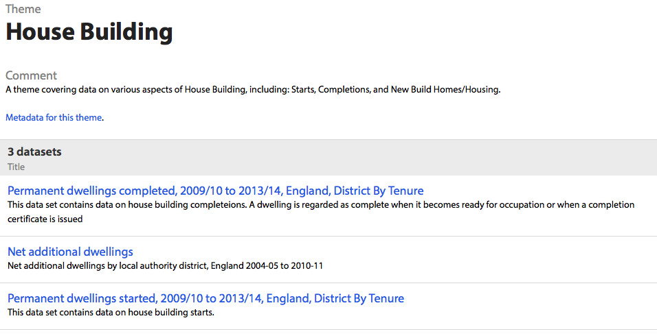

# How to use d3.js to create visualizations from Open Data Communities and NOMIS data

I've started an internship at [Swirrl](http://www.swirrl.com) a few weeks ago, and as the Swirrl motto is 'The Linked Data Company', I had to dig into linked data.
I had some existing knowledge of web development but I was almost a newbie. Consequently for this tutorial, you just need to know a little bit of HTML / CSS / Javascript. This tutorial aims to teach you how to:

* Query linked data using SPARQL
* Query an API
* Visualize data on a scatter plot using [d3.js](http://d3js.org)

[You can access the code on GitHub](https://github.com/NTerpo/DCLG_data_visualization) and [here is the demo of what we are going to do](http://jsfiddle.net/nicolasterpolilli/7ed26/5/embedded/result/).

## Step one, what is 'linked data' anyway?

To start we are going to get some data; this is probably the most difficult part of the tutorial. Nobody is naturally used to [the RDF linked data standard](http://en.wikipedia.org/wiki/Resource_Description_Framework)! You probably
know how to use an Excel spreadsheet, a CSV file or a SQL database, but RDF is, let's say a little different to these... To understand why this data is 'linked', try to imagine what the internet looked like before the link was invented:
a 'poor' list of resources. Links between resources have given the internet a lot of its significance; just as the internet can be described as a [graph](https://en.wikipedia.org/wiki/Webgraph), so it is with linked data. The concept as related to linked data is exactly the same; you have a huge amount of data with links between data points.

Still difficult to conceptualise? Don't worry, we will try it in an example, but you can probably already imagine how powerful what you are doing can be!

### Okay, so where can I find this 'linked data'?

There are more and more linked data sources available, but we will focus on Open Data Communities which is the UK Department for Communities and Local Government's official Linked Open Data site.

Data is organized by theme and we are first going to look at [House building data](http://opendatacommunities.org/themes/house-building).

The scatter plot we are going to make will compare the number of houses started and the number of houses completed, in one year, for each local authority in England.

The X axis will be houses started and the Y axis will be houses completed. Later on in the tutorial we will add labour market data and homelessness data so the scatter plot can help you understand the housing policy of each local authority.

### SPARQL query #1

So let's get that data! The main query language for querying RDF data is SPARQL. There are [some pretty good tutorials about SPARQL](https://jena.apache.org/tutorials/sparql.html); here I just want to show you how it works and how to understand the logic behind it. RDF data is expressed with triples in the form: subject, predicate (the link between two resources) and object. Data in this format can be thought of as like sentences: "The sky" (subject) "has" (predicate) "the color blue" (object). 
A SPARQL query looks like this : 

        SELECT ?x
        WHERE {
            ?x  <http://www.w3.org/2001/vcard-rdf/3.0#FN>  "John Smith" 
        }

You recognize the triple and we can make it more readable, using PREFIX :

        PREFIX w3: <http://www.w3.org/2001/vcard-rdf/3.0#>
        SELECT ?x
        WHERE {
            ?x  w3:FN  "John Smith" 
        }

### SPARQL query #2

By [exploring the data](http://opendatacommunities.org/data/house-building/completions/tenure/2013-2014/E06000008/all), you can start to see how data is organised and how it is linked together. The main information here (that is going to be our Y axis) is the 'Completions'; by clicking on Completions we can see that Completions is an Observation. Returning to the data, we also see that we can choose a `referencePeriod` and a `referenceArea`.

We want to know for each local authority how many houses have been completed during, let's say, 2012-2013. So our query will start like this : 

        SELECT * WHERE {
        ?observation <http://www.w3.org/1999/02/22-rdf-syntax-ns#type> <http://purl.org/linked-data/cube#Observation> ;
            <http://opendatacommunities.org/def/ontology/time/refPeriod> <http://reference.data.gov.uk/id/government-year/2012-2013> ; 
            <http://opendatacommunities.org/def/ontology/geography/refArea> ?refArea ; 
        }

which means : "What we would like to know is an observation, concerning the time period 2012-2013, a variable of which is the `refArea`". With prefixes you get :

        PREFIX geo: <http://opendatacommunities.org/def/ontology/geography/> // that's new!
        PREFIX year: <http://reference.data.gov.uk/id/government-year/> // that's new!
        PREFIX cube: <http://purl.org/linked-data/cube#> // that's new!
        PREFIX time: <http://opendatacommunities.org/def/ontology/time/> // that's new!
        PREFIX rdf: <http://www.w3.org/1999/02/22-rdf-syntax-ns#> // that's new!
        SELECT * WHERE {
        ?observation rdf:type cube:Observation ;
                   time:refPeriod year:2012-2013 ; 
                   geo:refArea ?refArea .
        }

[When you are trying to create your SPARQL query, you can - **and should** - test it step by step !](http://opendatacommunities.org/sparql)  

Now we want to get information about houses completed. This part is a bit weird because the system of local government in the UK is a total mess (and I'm French!) - some areas have a single tier of local government (called 'unitary authorities' or 'metropolitan district councils' or 'London borough councils') - and some areas have two levels: county councils and district councils. In cases where there are two tiers, most of the data is held at the lower tier (i.e. district councils, rather than county councils). 

To complete the observation characterization you have to add those two lines: 

        PREFIX geo: <http://opendatacommunities.org/def/ontology/geography/>
        PREFIX year: <http://reference.data.gov.uk/id/government-year/>
        PREFIX cube: <http://purl.org/linked-data/cube#>
        PREFIX time: <http://opendatacommunities.org/def/ontology/time/>
        PREFIX rdf: <http://www.w3.org/1999/02/22-rdf-syntax-ns#>
        PREFIX compl: <http://opendatacommunities.org/def/ontology/house-building/completions/>
        PREFIX building: <http://opendatacommunities.org/def/ontology/house-building/> 
        SELECT * WHERE {
        ?observation rdf:type cube:Observation ;
                   time:refPeriod year:2012-2013 ; 
                   geo:refArea ?refArea ;
                   compl:tenure <http://opendatacommunities.org/def/concept/general-concepts/tenure/all> ; // that's new!
                   building:completionsObs ?completions . // that's new!
        }

It's a first good step but you still have to explain what a `refArea` is.
   
        PREFIX time: <http://opendatacommunities.org/def/ontology/time/>
        PREFIX geo: <http://opendatacommunities.org/def/ontology/geography/>
        PREFIX gov: <http://opendatacommunities.org/def/local-government/> // that's new!
        PREFIX osgeo:  <http://data.ordnancesurvey.co.uk/ontology/admingeo/> // that's new!
        PREFIX year: <http://reference.data.gov.uk/id/government-year/>
        PREFIX cube: <http://purl.org/linked-data/cube#>
        PREFIX rdf: <http://www.w3.org/1999/02/22-rdf-syntax-ns#>
        PREFIX rdfs: <http://www.w3.org/2000/01/rdf-schema#> // that's new!
        PREFIX building: <http://opendatacommunities.org/def/ontology/house-building/>
        PREFIX compl: <http://opendatacommunities.org/def/ontology/house-building/completions/> 
        
        SELECT * WHERE {
          
          ?observation rdf:type cube:Observation ;
                     time:refPeriod year:2012-2013 ; 
                     geo:refArea ?refArea ;
                     compl:tenure <http://opendatacommunities.org/def/concept/general-concepts/tenure/all> ;
                     building:completionsObs ?completions .   
          
          ?refArea osgeo:gssCode ?gssCode ;  // that's new!
                     gov:isGovernedBy ?authority . // that's new!
          
          ?authority rdfs:label ?authorityName . // that's new!
        }
        
Now you are saying: "What we would like to know is an observation, concerning the time period 2012-2013, a variable of which is the `refArea` and which concerns what we will call completions. The `refArea` would be the GSS code; each `refArea` is governed by an authority and we need the name of that authority as well!"

We almost have the query we're after, we just need 2 or 3 more steps - stay focused!

First we will select exactly the information we need by replacing that `*`:

        PREFIX time: <http://opendatacommunities.org/def/ontology/time/>
        PREFIX geo: <http://opendatacommunities.org/def/ontology/geography/>
        PREFIX gov: <http://opendatacommunities.org/def/local-government/>
        PREFIX osgeo:  <http://data.ordnancesurvey.co.uk/ontology/admingeo/>
        PREFIX year: <http://reference.data.gov.uk/id/government-year/>
        PREFIX cube: <http://purl.org/linked-data/cube#>
        PREFIX rdf: <http://www.w3.org/1999/02/22-rdf-syntax-ns#>
        PREFIX rdfs: <http://www.w3.org/2000/01/rdf-schema#>
        PREFIX building: <http://opendatacommunities.org/def/ontology/house-building/>
        PREFIX compl: <http://opendatacommunities.org/def/ontology/house-building/completions/> 
        
        SELECT ?refArea ?observation ?gssCode ?authorityName ?completions WHERE { // that's new!
          ?observation rdf:type cube:Observation ;
                       time:refPeriod year:2012-2013 ; 
                       geo:refArea ?refArea ;
                       compl:tenure <http://opendatacommunities.org/def/concept/general-concepts/tenure/all> ;
                       building:completionsObs ?completions .   
         
          ?refArea osgeo:gssCode ?gssCode ; 
                       gov:isGovernedBy ?authority .
                       
          ?authority rdfs:label ?authorityName .
        }
        
Now recall that we want a scatter plot with both  [completed](http://opendatacommunities.org/data/house-building/completions/tenure) and  [started](http://opendatacommunities.org/data/house-building/starts/tenure) housing data represented. We are going to combine everything in the same query by way of a second observation:

        PREFIX time: <http://opendatacommunities.org/def/ontology/time/>
        PREFIX geo: <http://opendatacommunities.org/def/ontology/geography/>
        PREFIX gov: <http://opendatacommunities.org/def/local-government/>
        PREFIX osgeo:  <http://data.ordnancesurvey.co.uk/ontology/admingeo/>
        PREFIX year: <http://reference.data.gov.uk/id/government-year/>
        PREFIX cube: <http://purl.org/linked-data/cube#>
        PREFIX rdf: <http://www.w3.org/1999/02/22-rdf-syntax-ns#>
        PREFIX rdfs: <http://www.w3.org/2000/01/rdf-schema#>
        PREFIX building: <http://opendatacommunities.org/def/ontology/house-building/>
        PREFIX compl: <http://opendatacommunities.org/def/ontology/house-building/completions/> 
        
        SELECT ?refArea ?observation ?gssCode ?authorityName ?completions ?starts ?observation2 WHERE { // that's new!
        
          ?observation rdf:type cube:Observation ;
                       time:refPeriod year:2012-2013 ; 
                       geo:refArea ?refArea ;
                       compl:tenure <http://opendatacommunities.org/def/concept/general-concepts/tenure/all> ;
                       building:completionsObs ?completions .   
                       
          ?observation2 rdf:type cube:Observation ; // that's new!
                        time:refPeriod year:2012-2013 ;  // that's new!
                        starts:tenure <http://opendatacommunities.org/def/concept/general-concepts/tenure/all> ; // that's new!
                        geo:refArea ?refArea ;  // that's new!
                        building:startsObs ?starts . // that's new!
                        
          ?refArea osgeo:gssCode ?gssCode ; 
                   gov:isGovernedBy ?authority .
        
          ?authority rdfs:label ?authorityName .
        }
        
Almost there! Two last things are important to note: first we will order our data by number of started houses (our X axis). Second, that SPARQL will allow us **to focus the query** on certain graphs to be more efficient. Finally, our query is: 

        PREFIX time: <http://opendatacommunities.org/def/ontology/time/>
        PREFIX geo: <http://opendatacommunities.org/def/ontology/geography/>
        PREFIX gov: <http://opendatacommunities.org/def/local-government/>
        PREFIX osgeo:  <http://data.ordnancesurvey.co.uk/ontology/admingeo/>
        PREFIX year: <http://reference.data.gov.uk/id/government-year/>
        PREFIX cube: <http://purl.org/linked-data/cube#>
        PREFIX rdf: <http://www.w3.org/1999/02/22-rdf-syntax-ns#>
        PREFIX rdfs: <http://www.w3.org/2000/01/rdf-schema#>
        PREFIX building: <http://opendatacommunities.org/def/ontology/house-building/>
        PREFIX starts: <http://opendatacommunities.org/def/ontology/house-building/starts/>
        PREFIX compl: <http://opendatacommunities.org/def/ontology/house-building/completions/>
        
        SELECT ?refArea ?observation ?gssCode ?authorityName ?completions ?starts ?observation2 WHERE { 
        
            GRAPH <http://opendatacommunities.org/graph/house-building/completions/tenure> { // that's new!
                ?observation rdf:type cube:Observation ;
                   time:refPeriod year:2012-2013 ; 
                   geo:refArea ?refArea ; 
                   compl:tenure <http://opendatacommunities.org/def/concept/general-concepts/tenure/all> ;
                   building:completionsObs ?completions .
            }
        
            GRAPH <http://opendatacommunities.org/graph/house-building/starts/tenure> { // that's new!
                ?observation2 rdf:type cube:Observation ;
                    time:refPeriod year:2012-2013 ; 
                    starts:tenure <http://opendatacommunities.org/def/concept/general-concepts/tenure/all> ;
                    geo:refArea ?refArea ; 
                    building:startsObs ?starts .
            }
        
            GRAPH <http://opendatacommunities.org/graph/ontology/geography/ons-labels> { // that's new!
                ?refArea osgeo:gssCode ?gssCode ; 
                      gov:isGovernedBy ?authority .
            }
        
            GRAPH <http://opendatacommunities.org/graph/local-authorities> { // that's new!
                ?authority rdfs:label ?authorityName .
            }
            
        } ORDER BY(?starts) // that's new!
        
Here we are! I hope you feel suitably proud, because you just wrote your first SPARQL query! [How about giving it a whirl?](http://opendatacommunities.org/sparql?query=PREFIX+time%3A+%3Chttp%3A%2F%2Fopendatacommunities.org%2Fdef%2Fontology%2Ftime%2F%3E%0D%0APREFIX+geo%3A+%3Chttp%3A%2F%2Fopendatacommunities.org%2Fdef%2Fontology%2Fgeography%2F%3E%0D%0APREFIX+gov%3A+%3Chttp%3A%2F%2Fopendatacommunities.org%2Fdef%2Flocal-government%2F%3E%0D%0APREFIX+osgeo%3A++%3Chttp%3A%2F%2Fdata.ordnancesurvey.co.uk%2Fontology%2Fadmingeo%2F%3E%0D%0APREFIX+year%3A+%3Chttp%3A%2F%2Freference.data.gov.uk%2Fid%2Fgovernment-year%2F%3E%0D%0APREFIX+cube%3A+%3Chttp%3A%2F%2Fpurl.org%2Flinked-data%2Fcube%23%3E%0D%0APREFIX+rdf%3A+%3Chttp%3A%2F%2Fwww.w3.org%2F1999%2F02%2F22-rdf-syntax-ns%23%3E%0D%0APREFIX+rdfs%3A+%3Chttp%3A%2F%2Fwww.w3.org%2F2000%2F01%2Frdf-schema%23%3E%0D%0APREFIX+building%3A+%3Chttp%3A%2F%2Fopendatacommunities.org%2Fdef%2Fontology%2Fhouse-building%2F%3E%0D%0APREFIX+starts%3A+%3Chttp%3A%2F%2Fopendatacommunities.org%2Fdef%2Fontology%2Fhouse-building%2Fstarts%2F%3E%0D%0APREFIX+compl%3A+%3Chttp%3A%2F%2Fopendatacommunities.org%2Fdef%2Fontology%2Fhouse-building%2Fcompletions%2F%3E%0D%0A%0D%0ASELECT+%3FrefArea+%3Fobservation+%3FgssCode+%3FauthorityName+%3Fcompletions+%3Fstarts+%3Fobservation2+WHERE+%7B+%0D%0A%0D%0A+++GRAPH+%3Chttp%3A%2F%2Fopendatacommunities.org%2Fgraph%2Fhouse-building%2Fcompletions%2Ftenure%3E+%7B+%0D%0A++++++%3Fobservation+rdf%3Atype+cube%3AObservation+%3B%0D%0A+++++++++++++++++++time%3ArefPeriod+year%3A2012-2013+%3B+%0D%0A+++++++++++++++++++geo%3ArefArea+%3FrefArea+%3B+%0D%0A+++++++++++++++++++compl%3Atenure+%3Chttp%3A%2F%2Fopendatacommunities.org%2Fdef%2Fconcept%2Fgeneral-concepts%2Ftenure%2Fall%3E+%3B%0D%0A+++++++++++++++++++building%3AcompletionsObs+%3Fcompletions+.%0D%0A+++%7D%0D%0A%0D%0A+++GRAPH+%3Chttp%3A%2F%2Fopendatacommunities.org%2Fgraph%2Fhouse-building%2Fstarts%2Ftenure%3E+%7B+%0D%0A++++++%3Fobservation2+rdf%3Atype+cube%3AObservation+%3B%0D%0A++++++++++++++++++++time%3ArefPeriod+year%3A2012-2013+%3B+%0D%0A++++++++++++++++++++starts%3Atenure+%3Chttp%3A%2F%2Fopendatacommunities.org%2Fdef%2Fconcept%2Fgeneral-concepts%2Ftenure%2Fall%3E+%3B%0D%0A++++++++++++++++++++geo%3ArefArea+%3FrefArea+%3B+%0D%0A++++++++++++++++++++building%3AstartsObs+%3Fstarts+.%0D%0A+++%7D%0D%0A%0D%0A+++GRAPH+%3Chttp%3A%2F%2Fopendatacommunities.org%2Fgraph%2Fontology%2Fgeography%2Fons-labels%3E+%7B%0D%0A+++++%3FrefArea+osgeo%3AgssCode+%3FgssCode+%3B+%0D%0A++++++++++++++gov%3AisGovernedBy+%3Fauthority+.%0D%0A+++%7D%0D%0A%0D%0A+++GRAPH+%3Chttp%3A%2F%2Fopendatacommunities.org%2Fgraph%2Flocal-authorities%3E+%7B+%0D%0A++++++%3Fauthority+rdfs%3Alabel+%3FauthorityName+.%0D%0A+++%7D%0D%0A%0D%0A%7D+ORDER+BY%28%3Fstarts%29)

### API

Now that we have the data, we want both easy access to it and it to be as up-to-date as possible. To that end we will use the API provided by Open Data Communities. Just under your query (on the last link), there is an API section where you can specify a return format; choose CSV and copy the link given.

Everything fine? Don't hesitate to ask anything in the comment box! Now we're going to attack the visualization part, which is the easy part in my opinion.

## Step two, basic scatter plot with d3.js

If you want to discover all what d3 can do for you, then [I highly recommand Scott Murray's tutorial](http://chimera.labs.oreilly.com/books/1230000000345/index.html), which is available as a free e-book online.
 D3 means Data Driven Document; we've got the data so we now need a document! We start with a simple HTML page, adding a single line of code to call the d3.js library. 
 
#### index.html

        <!DOCTYPE html>
        <html>
        <head>
            <meta charset="utf-8">
            <title>Housing in England</title>
            
            <!-- d3.js library -->
            
        </head>
        <body>
            
        </body>
        </html>

D3 uses [SVG](https://en.wikipedia.org/wiki/Scalable_Vector_Graphics) to bind data to the document, so the first step will be to create the svg between the 'script' tags.

        var width = 1000,
            height = 700;
        var padding = 40;
        var svg = d3.select("body")
                    .append("svg")
                    .attr("width", width)
                    .attr("height", height);

Then we add the link to the API we copied earlier. If you've got some experience working with APIs, you'll soon see one of D3's most magical features, as well as why we selected `CSV` and not `JSON`: 

        var width = 1000,
            height = 700;
        var padding = 40;
        var svg = d3.select("body")
                    .append("svg")
                    .attr("width", width)
                    .attr("height", height);
        var datasource = "http://LinkYouCopiedAtStepOne";

### Load data

Now we can load the data with d3:

        // Loading data     
            d3.csv(datasource, function (data) {
            // the code for the next steps will go here
            })

At this step you should start a server using your terminal on the root directory of the `index.html` file. These instructions hold true for OSX and Linux. For Windows, you will need to install Python, but if you're going to that hassle then frankly you might as well [get a more suitable OS for free](http://www.ubuntu.com/download/desktop) for all the data visualization you're about to get addicted to doing. 

        $ python -m SimpleHTTPServer 8080

Now open a browser at `http://localhost:8080` to see your web page. If you open the console (e.g. Firebug on Firefox, DevTools on Chrome - both are accessible by right-clicking) and reload the page you'll see that an [HTTP GET request](http://www.w3.org/Protocols/rfc2616/rfc2616-sec5.html) is made to the Open Data Communities API, and data is loaded!

### Scale

Given the distribution of our data we will use a logarithmic scale (if you start with a linear one, you'll see for yourself why we chose a log one). We use the d3 scale function to create two variables, `xScale` and `yScale`:

        // Scaling
        var xScale = d3.scale.log()
                .domain([10, d3.max(data, function (d) {
                            return parseInt(d.starts) ;
                        })
                ])
                .range([padding, width - padding]);
        var yScale = d3.scale.log()
                .domain([10, d3.max(data, function (d) {
                            return parseInt(d.completions) ;
                        })
                ])
                .range([height - padding, padding]);

### Circles

It's time for the best part of the code: you're about to see the data! The point here is that we use a log scale so you don't want to have any 'log(0)'. That's why we place an `if` statement for the `cx` and `cy` attributes:

        // Pass data to svg
        svg.selectAll("circle")
            .data(data)
            .enter()
            .append("circle")
            .attr("cx", function (d) {
                if (parseInt(d.starts) === 0) {
                    return xScale(5);
                } else {
                    return xScale(d.starts);
                }
            })
            .attr("cy", function (d) {
                if (parseInt(d.completions) === 0) {
                    return yScale(5);
                } else {
                    return yScale(d.completions);
                }
            })
            .attr("r", function (d) {
                return (2.5);
            })
		    .style("fill", "black");

You should have something like the following when you reload your browser:

Of course it's not exactly what you expected yet but it's a good first step. Now let's add some axes and information.
        
### Axes

        // Axis
        var formatSi = d3.format(".4");
            svg.append("g")
                .attr("class", "axis") 
                .attr("transform", "translate(0," + (height - padding) + ")")     
                .call(d3.svg.axis()
                .scale(xScale)
                .orient("bottom")
                .ticks(5, function(d, i) {
                    return formatSi(d);
                }))
                .append("text")
                .attr("class", "label")
                .attr("x", width - padding)
                .attr("y", -6)
                .style("text-anchor", "end")
                .text("started building house");

            svg.append("g")
                .attr("class", "axis") 
                .attr("transform", "translate(" + padding + ",0)")
                .call(d3.svg.axis()
            .scale(yScale)
                .orient("left")
                .ticks(5, function(d, i) {
                    return formatSi(d);
                }))
                .append("text")
                .attr("class", "label")
                .attr("transform", "rotate(-90)")
                .attr("x", - padding)
                .attr("y", 6)
                .attr("dy", ".71em")
                .style("text-anchor", "end")
                .text("completed building house");

Not bad, but let's take a moment to think about the style...

        .axis path,
        .axis line {
            fill: none;
            stroke: black;
            shape-rendering: crispEdges;
        }
        .axis text {
            font-family: sans-serif;
            font-size: 10px;
        }
        .label {
            font-family: sans-serif;
            font-size: 10px;
        }

### Tooltip

Our scatter plot is not really useful yet; we've got some points but we don't know what they represent. I suggest you add a tooltip - then, when you click on a point you can see the local authority and house building data immediately:

First, you need too add a little bit of html: 

        

            

        
       

Then, a little bit of CSS: 

        #tooltip {
            position: absolute;
            width: 200px;
            height: auto;
            padding: 5px;
            background-color: rgb(245,245,245);
            opacity: 0.7;
            -webkit-border-radius: 10px;
            -moz-border-radius: 10px;
            border-radius: 10px;
            -webkit-box-shadow: 4px 4px 10px rgba(0, 0, 0, 0.4);
            -moz-box-shadow: 4px 4px 10px rgba(0, 0, 0, 0.4);
            box-shadow: 4px 4px 10px rgba(0, 0, 0, 0.4);
        }
        #tooltip.hidden {
            display: none;
        }
        #tooltip p {
            margin: 0;
            font-family: Arial, "Lucida Grande", sans-serif;
            line-height: 15px;
        }
        #tooltip span {
            font-family: sans-serif;
            font-size: 10px;
        }
        #tooltip a{
            text-decoration: none
        }

Then, a quite big chunk of JS just after the `style` attribute of your circles:        

        .attr("r", function (d) {
            return (2.5);
        })
	    .style("fill", "black")
        .on("click", function (d, i) {
            var tooltip = d3.select("#tooltip");
            if (tooltip.classed("hidden") == true) {                
            // Define and show the tooltip
                // Get this circle's x/y values, then use for the tooltip
                var xPosition = 0;
                if (parseFloat(d3.select(this).attr("cx")) < ((4 * width) / 5)) {
                    xPosition = parseFloat(d3.select(this).attr("cx")) + 15;
                } else {
                    xPosition = parseFloat(d3.select(this).attr("cx")) - 25 - 185;
                }            
                var yPosition = parseFloat(d3.select(this).attr("cy")) / 2 + height / 10
                // Update the tooltip position and value
                d3.select("#tooltip")
                    .style("left", xPosition + "px")
                    .style("top", yPosition + "px")
                    .html('<h3>' + '<a href = "' + d.refArea + '" target="_blank">' + d.authorityName + '</a>' + 
                            '</h3>' + 
                            '' + 
                            "Completed house building " + (d.observation).split("/")[7] + " : " + 
                            '' +
                            '<a href = "' + d.observation + '" target="_blank">' + d.completions + '</a>' + 
                            ' ' +
                            '' +
                            "Started house building " + (d.observation).split("/")[7] + " : " +  
                            '' +
                            '<a href = "' + d.observation2 + '" target="_blank">' + d.starts + '</a>' + 
                            ' ' + 
                            '' +
                            "Numbers of households accommodated by local authorities per 1000 households " 
                            + (d.observation3).split("/")[7] + " : " + 
                            '' +
                            '<a href = "' + d.observation3 + '" target="_blank">' + d.homelessness + '</a>' + 
                            ' ' + 
                            '' +
                            '<a href = "http://www.nomisweb.co.uk/articles/649.aspx" target="_blank">' + "Jobs density" + '</a>' + 
                            " : " + 
                            '' +
                            d.job
                    );
                    // Show the tooltip
                    d3.select("#tooltip").classed("hidden", false);
                } else {        
                    // Hide the tooltip
                    d3.select("#tooltip").classed("hidden", true);
                }
            });

That's not bad but we are going to improve it in the third step of this tutorial!

## Step three, improve your visualization 

### Acceptable area

The idea here is to display a light grey area on the scatter plot to visualise circles where the number of houses completed during the year is equal to +/- 30% the number of houses started during the year. 

Be careful, d3 displays everything in the same order as the code itself, that's why you have to place this code **before** the code that displays the circles and just after the scaling.

        // Acceptable values domain
        svg.append("path")
            .datum(data)
            .attr("class", "area")
            .attr("d", d3.svg.area()
            .x(function (d) {
                if (parseInt(d.starts) === 0) {
                    return xScale(10);
                } else {
                    return xScale(d.starts);
                }
            })
            .y0(function (d) {
                if (parseInt(d.starts) < 10) {
                    return height - padding;
                } else {
                    return yScale(1.3 * d.starts);
                }
            })
            .y1(function (d) {
                if (parseInt(d.starts) < 10) {
                    return height - padding;
                } else {
                    return yScale(0.7 * d.starts);
                }
            }));
            
Add the following CSS :

        .area {
            fill: rgb(222,235,247);
        }

### Circles radius

This part is a bit more tricky... because we are going to use SPARQL again. SPARQL is kind of scary at the beginning but you'll get used to it, the learning curve looks like a logarithm..

We would like to visualize [homelessness data](http://opendatacommunities.org/themes/homelessness) as the circles' radius. To do this, we just have to change our SPARQL query a little: 

        PREFIX time: <http://opendatacommunities.org/def/ontology/time/>
        PREFIX geo: <http://opendatacommunities.org/def/ontology/geography/>
        PREFIX gov: <http://opendatacommunities.org/def/local-government/>
        PREFIX osgeo:  <http://data.ordnancesurvey.co.uk/ontology/admingeo/>
        PREFIX year: <http://reference.data.gov.uk/id/government-year/>
        PREFIX quarter: <http://reference.data.gov.uk/id/quarter/> // that's new!
        PREFIX period: <http://opendatacommunities.org/def/ontology/time/> // that's new!
        PREFIX cube: <http://purl.org/linked-data/cube#>
        PREFIX rdf: <http://www.w3.org/1999/02/22-rdf-syntax-ns#>
        PREFIX rdfs: <http://www.w3.org/2000/01/rdf-schema#>
        PREFIX building: <http://opendatacommunities.org/def/ontology/house-building/>
        PREFIX starts: <http://opendatacommunities.org/def/ontology/house-building/starts/>
        PREFIX compl: <http://opendatacommunities.org/def/ontology/house-building/completions/>
        PREFIX homelessness: <http://opendatacommunities.org/def/ontology/homelessness/> // that's new!

        SELECT ?authorityName ?starts ?completions ?homelessness ?gssCode ?refArea ?observation ?observation2 ?observation3 WHERE {  // that's new!

           GRAPH <http://opendatacommunities.org/graph/house-building/completions/tenure> { 
              ?observation rdf:type cube:Observation ;
                           time:refPeriod year:2012-2013 ; 
                           geo:refArea ?refArea ; 
                           compl:tenure <http://opendatacommunities.org/def/concept/general-concepts/tenure/all> ;
                           building:completionsObs ?completions .
           }

           GRAPH <http://opendatacommunities.org/graph/house-building/starts/tenure> { 
              ?observation2 rdf:type cube:Observation ;
                            time:refPeriod year:2012-2013 ; 
                            starts:tenure <http://opendatacommunities.org/def/concept/general-concepts/tenure/all> ;
                            geo:refArea ?refArea ; 
                            building:startsObs ?starts .
           }

            GRAPH <http://opendatacommunities.org/graph/homelessness/households-accommodated-per-1000/temporary-housing-types> {  // that's new!
              ?observation3 rdf:type cube:Observation ; // that's new!
                           period:refPeriod quarter:2012-Q1 ;  // that's new!
                           geo:refArea ?refArea ;  // that's new!
                           homelessness:householdsAccommodatedPer1000Obs ?homelessness . // that's new!
           } 

           GRAPH <http://opendatacommunities.org/graph/ontology/geography/ons-labels> {
             ?refArea osgeo:gssCode ?gssCode ; 
                      gov:isGovernedBy ?authority .
           }

           GRAPH <http://opendatacommunities.org/graph/local-authorities> { 
              ?authority rdfs:label ?authorityName .
           }

        } ORDER BY(?starts)

Run this query and get a new link from the API, replacing the old one on the `datasource` variable. Now you have an accessor for homelessness data via `.homelessness`, so you can modify your code for the circles: 

        .attr("r", function (d) {
            return (2.5 + 0.8 * Math.sqrt(d.homelessness));
        })

I have used a square root for legibility.

### Colours

Now steel yourself, for **we are going to mix Open Data Communities data that we already have with data from the NOMIS API which is UK labour market data**. Our goal is to have the circles' colour be a function of job density.

Now we need to retrieve this new data from the NOMIS API. That's not really easy; [here's some documentation on working with the NOMIS API](https://github.com/the-frey/odc_nomis). In my opinion, creating an account and using the query wizard is the way to go!

Here's the link I get at the end:  

`http://www.nomisweb.co.uk/api/v01/dataset/NM_57_1.data.csv?geography=1946157057...1946157382&date=latest&item=3&measures=20100&select=date_name,geography_name,geography_code,item_name,measures_name,obs_value,obs_status_name`

You will then need to add this link to your document: 

        var nomisData = "http://www.nomiswebAPILink";

Before changing our circles' colour we are going to merge both datasets. In the first dataset, for each local authority, we are going to add the job density:

        // Merge dataset with NOMIS dataset
        d3.csv(nomisData, function (nomis) {
            for (var i = 0; i < data.length; i++) {
                // Grab GSS code from ODC dataset
                var dataGss = data[i].gssCode;

                for (var j = 0; j < nomis.length; j++) {

                    var nomisGss = nomis[j].GEOGRAPHY_CODE;

                    if (dataGss == nomisGss) {

                        // Copy job density value into the ODC csv
                        data[i].job = nomis[j].OBS_VALUE;
                        break;
                    } 
                }
            }
            // Pass data to svg....
            });
            
Then we can add a colour function with a logarithmic scale that will colourise our circles: 

        // Color - jobs density data
        var color = d3.scale.log()
                .domain([0.2, 2])
                .range(['rgb(240,59,32)','rgb(255,237,160)']);
                
The `domain` represents the data we are colourising (most of jobs density is between 0.2 and 2). The range represents the colours we are going to use; you can find a nice range of colours on [ColorBrewer2](http://colorbrewer2.org).

Now you can change the circles' colour: 

	    .style("fill", function (d) {
	        return color(d.job);
	    })

Pretty awesome, no?! The next step is to explain to people who view your scatter plot what are they looking at...

### Legend

With everything you've learned, displaying a legend should be easy now. The difficult parts are positioning legends and displaying a colour gradient.

        // Legend area
        svg.append("rect")
            .attr("x", width - 58)
            .attr("y", height - padding - 43)
            .attr("width", 18)
            .attr("height", 18)
            .style("fill", "rgb(222,235,247)");

        svg.append("text")
            .attr("class", "label")
            .attr("x", width - 60)
            .attr("y", height - padding - 35)
            .attr("dy", ".35em")
            .style("text-anchor", "end")
            .text("completed = +/- 30% started");
            
        // Legend circles 
        svg.append("rect")
            .attr("class", "legend")
            .attr("x", width - 155)
            .attr("y", height - padding - 80)
            .attr("width", 110)
            .attr("height", 10)
            .style("fill", "url(#gradient)");
            
        svg.append("linearGradient")
            .attr("id", "gradient")
            .attr("x1", "0%")
            .attr("y1", "0%")
            .attr("x2", "100%")
            .attr("y2", "0%")
           .selectAll("stop")
            .data([
                {offset: "0%", color: color.range()[0]},
                {offset: "100%", color: color.range()[1]}
            ])
           .enter().append("stop")
            .attr("offset", function(d) { return d.offset; })
            .attr("stop-color", function(d) { return d.color; });   
        
        svg.append("text")
            .attr("class", "label")
            .attr("x", width - 40)
            .attr("y", height - padding - 60)
            .attr("dy", ".35em")
            .style("text-anchor", "end")
            .text("> " + color.domain()[1]);
        
        svg.append("text")
            .attr("class", "label")
            .attr("x", width - 135)
            .attr("y", height - padding - 60)
            .attr("dy", ".35em")
            .style("text-anchor", "end")
            .text(color.domain()[0] + " <");
        
        svg.append("text")
            .attr("class", "label")
            .attr("x", width - 70)
            .attr("y", height - padding - 90)
            .attr("dy", ".35em")
            .style("text-anchor", "end")
            .text("Jobs density");
            

### Mouse over / out

Just a little piece of code to stroke the circles on mouse over (for better user experience):

        .on("mouseover", over)
        .on("mouseout", out);

        // Over function, called on mouseover
        function over (d, i) {
            d3.select(this)
                .attr("stroke-width", 1.5)
                .attr("stroke", "black");
        
        }
        
        // Out function, called on mouseout
        function out (d, i) {
            d3.select(this)
                .attr("stroke", "none");
        }

## Step four, compare between two time periods

The scatter plot looks a lot better now, we are just going to add one last improvement - that we would like to be able to change the time period shown by clicking a button.

The first step is, naturally, to make a new SPARQL query for 2011-2012 instead of 2012-2013. I'll let you do this part by yourself, it should be second nature by now!

Then we will change our datasource variable :

        var datasource_2012_2013 = "http://opendatacommunities.org/sparLink";
        var datasource_2011_2012 = "http://opendatacommunities.org/sparLink2";
        var nomisData = "http://www.nomiswebLink";
        
        var datasource =    [datasource_2011_2012,
                            datasource_2012_2013
                            ];
                            
        // Used to select the dataset to show                        
        var ds = datasource.length - 1;
        
        // Loading data     
        d3.csv(datasource[ds], function (data) { ......

Then we add a button:

        

            <button id="change_period">2011-12 / 2012-13</button>
        

As well as the CSS

        #change_period {
            position:relative;
            left: 1000px;
            top: 40px;
            width: auto;
            height: auto;
            padding: 10px;
            background-color: rgb(49,130,189);
            border: 0;
            text-align: center;
            font-size: 15px;
            color: white;
        }

Finally we would like it so that when the button is clicked: 

1. We update the data with another dataset 
2. We merge the data with NOMIS API data 
3. We adapt the scale 
4. We display a seamless transition between both datasets. 

This is part of why d3.js is so powerful, transitions are as simple as writting "transition()"...

        d3.select("#change_period")
            .on("click", function() { 
                
                if (ds === datasource.length - 1) {
                    ds = 0;
                } else {
                    ds++;
                }
                
                d3.csv(datasource[ds], function (data) {

                    
                    // Merge dataset with NOMIS dataset
                    d3.csv(nomisData, function (nomis) {
                        for (var i = 0; i < data.length; i++) {
                            // Grab GSS code from ODC dataset
                            var dataGss = data[i].gssCode;

                            for (var j = 0; j < nomis.length; j++) {

                                var nomisGss = nomis[j].GEOGRAPHY_CODE;

                                if (dataGss == nomisGss) {

                                    // Copy job density value into the ODC csv
                                    data[i].job = nomis[j].OBS_VALUE;
                                    break;
                                } 
                            }
                        }
                        // Scaling
                        var xScale = d3.scale.log()
                                                .domain([10, d3.max(data, function (d) {
                                                                return parseInt(d.starts) ;
                                                            })
                                                        ])
                                                .range([padding, width - padding]);
                        var yScale = d3.scale.log()
                                                .domain([10, d3.max(data, function (d) {
                                                                return parseInt(d.completions) ;
                                                            })
                                                        ])
                                                .range([height - padding, padding]);
                    
                                                
                        // Key function to bind data to element via gsscode
                        var key = function(d) {
                            return d.gssCode;
                        };
                        // Pass data to svg
                        svg.selectAll("circle")
                            .data(data, key)
                            .transition()                     
                            .duration(4000)
                            .attr("cx", function (d) {
                                if (parseInt(d.starts) === 0) {
                                    return xScale(5);
                                } else {
                                    return xScale(d.starts);
                                }
                            })
                            .attr("cy", function (d) {
                                if (parseInt(d.completions) === 0) {
                                    return yScale(5);
                                } else {
                                    return yScale(d.completions);
                                }
                            })
                            .attr("r", function (d) {
                                return (2.5 +  0.8 * Math.sqrt(d.homelessness));
                            })
                            .style("fill", function (d) {
                                return color(d.job);
                            })
                            .transition()
                            .duration(400);
                    })
                });
            });
            
Interesting point: we bind data to DOM elements via a key function indexed by GSS code, this way you can watch a local authority's housing policy moving data points on the scatter plot...

Here's what you should have: 

Remember that [you can access all the code for this tutorial on GitHub](https://github.com/NTerpo/DCLG_data_visualization)!

## Conclusion

There are a lot of ways you could potentially improve this scatter plot; here are some examples:

* You can ask yourself: 'what can we learn from this data visualization?'
* With this code we merge both datasets everytime we click the button (+ ~600 ms for each HTTP GET) : maybe it's possible to improve loading times?
* Make a responsive scatter plot
