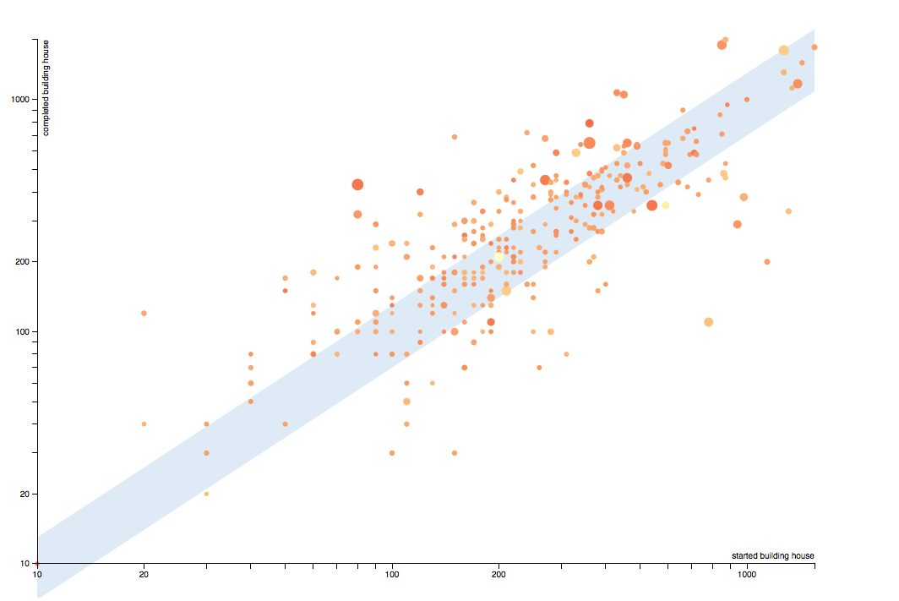

# How to use d3.js to create visualizations from Open Data Communities and NOMIS data. Part #2

After having queried the Open Data Communities API to get data and after having made a basic scatter plot [in the first part of this tutorial](https://github.com/NTerpo/DCLG_data_visualization/blob/master/tutorial_part1.md), it's time for some improvement! We are now going to improve the scatter plot, get some data from the NOMIS API, and, finally, we are going to implement a button that allow to switch between two differents time periods.

## Step one, improve your visualization 

### Acceptable area

The idea here is to display a light grey area on the scatter plot to visualise circles where the number of houses completed during the year is equal to +/- 30% the number of houses started during the year. 

Be careful, d3 displays everything in the same order as the code itself, that's why you have to place this code **before** the code that displays the circles and just after the scaling.

        // Acceptable values domain
        svg.append("path")
            .datum(data)
            .attr("class", "area")
            .attr("d", d3.svg.area()
            .x(function (d) {
                if (parseInt(d.starts) === 0) {
                    return xScale(10);
                } else {
                    return xScale(d.starts);
                }
            })
            .y0(function (d) {
                if (parseInt(d.starts) < 10) {
                    return height - padding;
                } else {
                    return yScale(1.3 * d.starts);
                }
            })
            .y1(function (d) {
                if (parseInt(d.starts) < 10) {
                    return height - padding;
                } else {
                    return yScale(0.7 * d.starts);
                }
            }));
            
Add the following CSS :

        .area {
            fill: rgb(222,235,247);
        }

### Circles radius

This part is a bit more tricky... because we are going to use SPARQL again. SPARQL is kind of scary at the beginning but you'll get used to it, the learning curve looks like a logarithm..

We would like to visualize [homelessness data](http://opendatacommunities.org/themes/homelessness) as the circles' radius. To do this, we just have to change our SPARQL query a little: 

        PREFIX time: <http://opendatacommunities.org/def/ontology/time/>
        PREFIX geo: <http://opendatacommunities.org/def/ontology/geography/>
        PREFIX gov: <http://opendatacommunities.org/def/local-government/>
        PREFIX osgeo:  <http://data.ordnancesurvey.co.uk/ontology/admingeo/>
        PREFIX year: <http://reference.data.gov.uk/id/government-year/>
        PREFIX quarter: <http://reference.data.gov.uk/id/quarter/> // that's new!
        PREFIX period: <http://opendatacommunities.org/def/ontology/time/> // that's new!
        PREFIX cube: <http://purl.org/linked-data/cube#>
        PREFIX rdf: <http://www.w3.org/1999/02/22-rdf-syntax-ns#>
        PREFIX rdfs: <http://www.w3.org/2000/01/rdf-schema#>
        PREFIX building: <http://opendatacommunities.org/def/ontology/house-building/>
        PREFIX starts: <http://opendatacommunities.org/def/ontology/house-building/starts/>
        PREFIX compl: <http://opendatacommunities.org/def/ontology/house-building/completions/>
        PREFIX homelessness: <http://opendatacommunities.org/def/ontology/homelessness/> // that's new!

        SELECT ?authorityName ?starts ?completions ?homelessness ?gssCode ?refArea ?observation ?observation2 ?observation3 WHERE {  // that's new!

           GRAPH <http://opendatacommunities.org/graph/house-building/completions/tenure> { 
              ?observation rdf:type cube:Observation ;
                           time:refPeriod year:2012-2013 ; 
                           geo:refArea ?refArea ; 
                           compl:tenure <http://opendatacommunities.org/def/concept/general-concepts/tenure/all> ;
                           building:completionsObs ?completions .
           }

           GRAPH <http://opendatacommunities.org/graph/house-building/starts/tenure> { 
              ?observation2 rdf:type cube:Observation ;
                            time:refPeriod year:2012-2013 ; 
                            starts:tenure <http://opendatacommunities.org/def/concept/general-concepts/tenure/all> ;
                            geo:refArea ?refArea ; 
                            building:startsObs ?starts .
           }

            GRAPH <http://opendatacommunities.org/graph/homelessness/households-accommodated-per-1000/temporary-housing-types> {  // that's new!
              ?observation3 rdf:type cube:Observation ; // that's new!
                           period:refPeriod quarter:2012-Q1 ;  // that's new!
                           geo:refArea ?refArea ;  // that's new!
                           homelessness:householdsAccommodatedPer1000Obs ?homelessness . // that's new!
           } 

           GRAPH <http://opendatacommunities.org/graph/ontology/geography/ons-labels> {
             ?refArea osgeo:gssCode ?gssCode ; 
                      gov:isGovernedBy ?authority .
           }

           GRAPH <http://opendatacommunities.org/graph/local-authorities> { 
              ?authority rdfs:label ?authorityName .
           }

        } ORDER BY(?starts)

Run this query and get a new link from the API, replacing the old one on the `datasource` variable. Now you have an accessor for homelessness data via `.homelessness`, so you can modify your code for the circles: 

        .attr("r", function (d) {
            return (2.5 + 0.8 * Math.sqrt(d.homelessness));
        })

I have used a square root for legibility.

### Colours

Now steel yourself, for **we are going to mix Open Data Communities data that we already have with data from the NOMIS API which is UK labour market data**. Our goal is to have the circles' colour be a function of job density.

Now we need to retrieve this new data from the NOMIS API. That's not really easy; [here's some documentation on working with the NOMIS API](https://github.com/the-frey/odc_nomis). In my opinion, creating an account and using the query wizard is the way to go!

Here's the link I get at the end:  

`http://www.nomisweb.co.uk/api/v01/dataset/NM_57_1.data.csv?geography=1946157057...1946157382&date=latest&item=3&measures=20100&select=date_name,geography_name,geography_code,item_name,measures_name,obs_value,obs_status_name`

You will then need to add this link to your document: 

        var nomisData = "http://www.nomiswebAPILink";

Before changing our circles' colour we are going to merge both datasets. In the first dataset, for each local authority, we are going to add the job density:

        // Merge dataset with NOMIS dataset
        d3.csv(nomisData, function (nomis) {
            for (var i = 0; i < data.length; i++) {
                // Grab GSS code from ODC dataset
                var dataGss = data[i].gssCode;

                for (var j = 0; j < nomis.length; j++) {

                    var nomisGss = nomis[j].GEOGRAPHY_CODE;

                    if (dataGss == nomisGss) {

                        // Copy job density value into the ODC csv
                        data[i].job = nomis[j].OBS_VALUE;
                        break;
                    } 
                }
            }
            // Pass data to svg....
            });
            
Then we can add a colour function with a logarithmic scale that will colourise our circles: 

        // Color - jobs density data
        var color = d3.scale.log()
                .domain([0.2, 2])
                .range(['rgb(240,59,32)','rgb(255,237,160)']);
                
The `domain` represents the data we are colourising (most of jobs density is between 0.2 and 2). The range represents the colours we are going to use; you can find a nice range of colours on [ColorBrewer2](http://colorbrewer2.org).

Now you can change the circles' colour: 

	    .style("fill", function (d) {
	        return color(d.job);
	    })

Pretty awesome, no?! The next step is to explain to people who view your scatter plot what are they looking at...

### Legend

With everything you've learned, displaying a legend should be easy now. The difficult parts are positioning legends and displaying a colour gradient.

        // Legend area
        svg.append("rect")
            .attr("x", width - 58)
            .attr("y", height - padding - 43)
            .attr("width", 18)
            .attr("height", 18)
            .style("fill", "rgb(222,235,247)");

        svg.append("text")
            .attr("class", "label")
            .attr("x", width - 60)
            .attr("y", height - padding - 35)
            .attr("dy", ".35em")
            .style("text-anchor", "end")
            .text("completed = +/- 30% started");
            
        // Legend circles 
        svg.append("rect")
            .attr("class", "legend")
            .attr("x", width - 155)
            .attr("y", height - padding - 80)
            .attr("width", 110)
            .attr("height", 10)
            .style("fill", "url(#gradient)");
            
        svg.append("linearGradient")
            .attr("id", "gradient")
            .attr("x1", "0%")
            .attr("y1", "0%")
            .attr("x2", "100%")
            .attr("y2", "0%")
           .selectAll("stop")
            .data([
                {offset: "0%", color: color.range()[0]},
                {offset: "100%", color: color.range()[1]}
            ])
           .enter().append("stop")
            .attr("offset", function(d) { return d.offset; })
            .attr("stop-color", function(d) { return d.color; });   
        
        svg.append("text")
            .attr("class", "label")
            .attr("x", width - 40)
            .attr("y", height - padding - 60)
            .attr("dy", ".35em")
            .style("text-anchor", "end")
            .text("> " + color.domain()[1]);
        
        svg.append("text")
            .attr("class", "label")
            .attr("x", width - 135)
            .attr("y", height - padding - 60)
            .attr("dy", ".35em")
            .style("text-anchor", "end")
            .text(color.domain()[0] + " <");
        
        svg.append("text")
            .attr("class", "label")
            .attr("x", width - 70)
            .attr("y", height - padding - 90)
            .attr("dy", ".35em")
            .style("text-anchor", "end")
            .text("Jobs density");
            

### Mouse over / out

Just a little piece of code to stroke the circles on mouse over (for better user experience):

        .on("mouseover", over)
        .on("mouseout", out);

        // Over function, called on mouseover
        function over (d, i) {
            d3.select(this)
                .attr("stroke-width", 1.5)
                .attr("stroke", "black");
        
        }
        
        // Out function, called on mouseout
        function out (d, i) {
            d3.select(this)
                .attr("stroke", "none");
        }

## Step two, compare between two time periods

The scatter plot looks a lot better now, we are just going to add one last improvement - that we would like to be able to change the time period shown by clicking a button.

The first step is, naturally, to make a new SPARQL query for 2011-2012 instead of 2012-2013. I'll let you do this part by yourself, it should be second nature by now!

Then we will change our datasource variable :

        var datasource_2012_2013 = "http://opendatacommunities.org/sparLink";
        var datasource_2011_2012 = "http://opendatacommunities.org/sparLink2";
        var nomisData = "http://www.nomiswebLink";
        
        var datasource =    [datasource_2011_2012,
                            datasource_2012_2013
                            ];
                            
        // Used to select the dataset to show                        
        var ds = datasource.length - 1;
        
        // Loading data     
        d3.csv(datasource[ds], function (data) { ......

Then we add a button:

        

            <button id="change_period">2011-12 / 2012-13</button>
        

As well as the CSS

        #change_period {
            position:relative;
            left: 1000px;
            top: 40px;
            width: auto;
            height: auto;
            padding: 10px;
            background-color: rgb(49,130,189);
            border: 0;
            text-align: center;
            font-size: 15px;
            color: white;
        }

Finally we would like it so that when the button is clicked: 

1. We update the data with another dataset 
2. We merge the data with NOMIS API data 
3. We adapt the scale 
4. We display a seamless transition between both datasets. 

This is part of why d3.js is so powerful, transitions are as simple as writting "transition()"...

        d3.select("#change_period")
            .on("click", function() { 
                
                if (ds === datasource.length - 1) {
                    ds = 0;
                } else {
                    ds++;
                }
                
                d3.csv(datasource[ds], function (data) {

                    
                    // Merge dataset with NOMIS dataset
                    d3.csv(nomisData, function (nomis) {
                        for (var i = 0; i < data.length; i++) {
                            // Grab GSS code from ODC dataset
                            var dataGss = data[i].gssCode;

                            for (var j = 0; j < nomis.length; j++) {

                                var nomisGss = nomis[j].GEOGRAPHY_CODE;

                                if (dataGss == nomisGss) {

                                    // Copy job density value into the ODC csv
                                    data[i].job = nomis[j].OBS_VALUE;
                                    break;
                                } 
                            }
                        }
                        // Scaling
                        var xScale = d3.scale.log()
                                                .domain([10, d3.max(data, function (d) {
                                                                return parseInt(d.starts) ;
                                                            })
                                                        ])
                                                .range([padding, width - padding]);
                        var yScale = d3.scale.log()
                                                .domain([10, d3.max(data, function (d) {
                                                                return parseInt(d.completions) ;
                                                            })
                                                        ])
                                                .range([height - padding, padding]);
                    
                                                
                        // Key function to bind data to element via gsscode
                        var key = function(d) {
                            return d.gssCode;
                        };
                        // Pass data to svg
                        svg.selectAll("circle")
                            .data(data, key)
                            .transition()                     
                            .duration(4000)
                            .attr("cx", function (d) {
                                if (parseInt(d.starts) === 0) {
                                    return xScale(5);
                                } else {
                                    return xScale(d.starts);
                                }
                            })
                            .attr("cy", function (d) {
                                if (parseInt(d.completions) === 0) {
                                    return yScale(5);
                                } else {
                                    return yScale(d.completions);
                                }
                            })
                            .attr("r", function (d) {
                                return (2.5 +  0.8 * Math.sqrt(d.homelessness));
                            })
                            .style("fill", function (d) {
                                return color(d.job);
                            })
                            .transition()
                            .duration(400);
                    })
                });
            });
            
Interesting point: we bind data to DOM elements via a key function indexed by GSS code, this way you can watch a local authority's housing policy moving data points on the scatter plot...

Here's what you should have: 

Remember that [you can access all the code for this tutorial on GitHub](https://github.com/NTerpo/DCLG_data_visualization)!

## Conclusion

There are a lot of ways you could potentially improve this scatter plot; here are some examples:

* You can ask yourself: 'what can we learn from this data visualization?'
* With this code we merge both datasets everytime we click the button (+ ~600 ms for each HTTP GET) : maybe it's possible to improve loading times?
* Make a responsive scatter plot